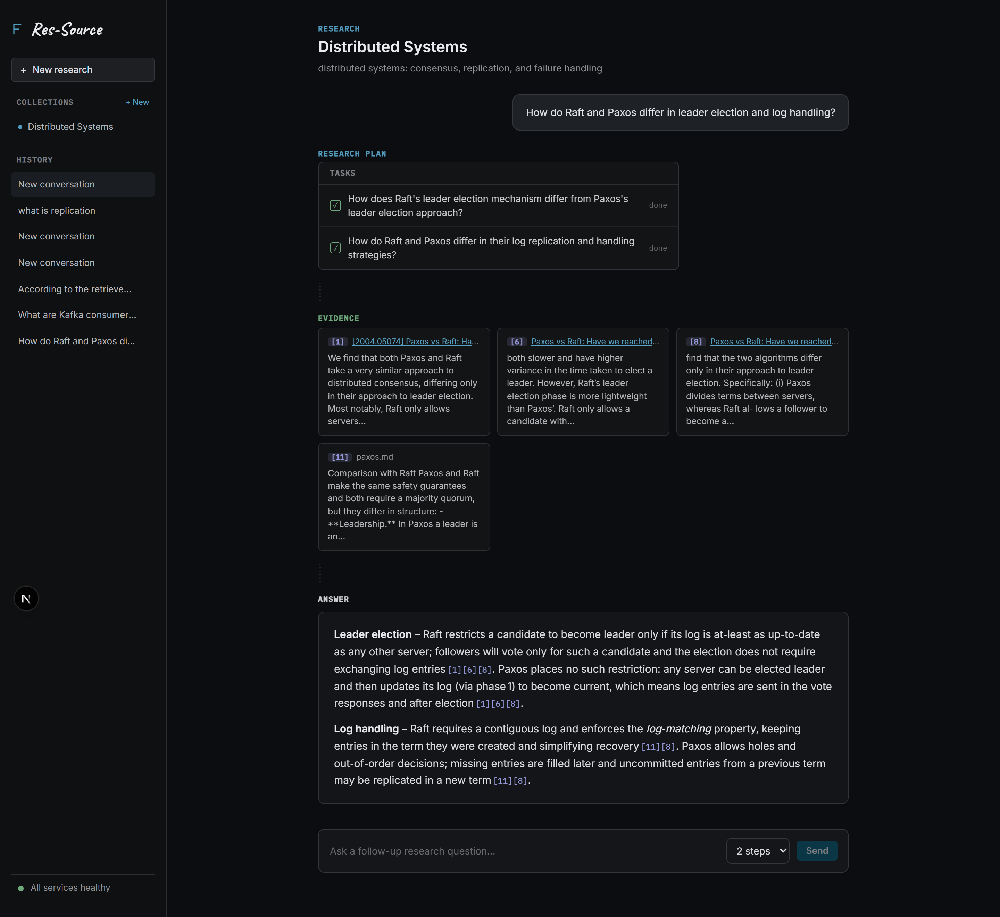
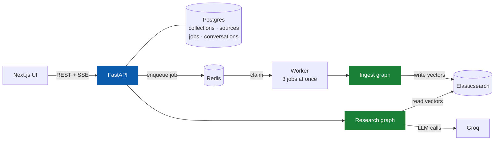
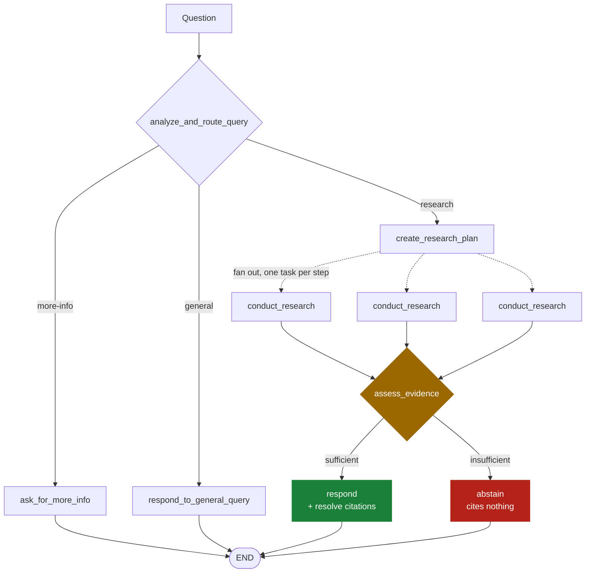
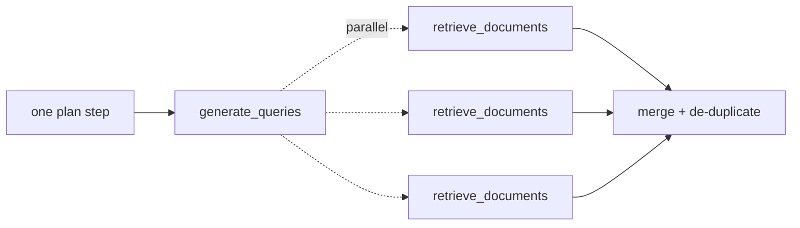
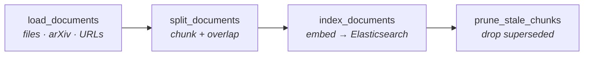
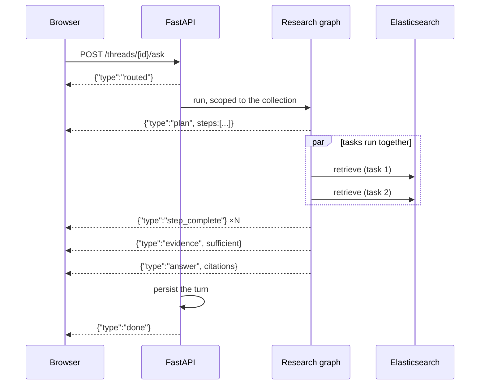
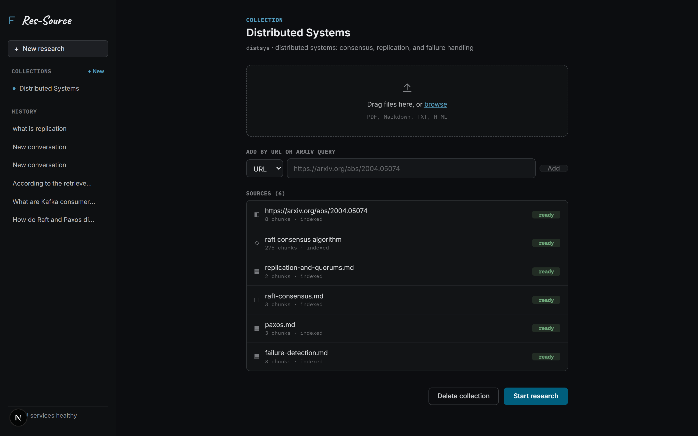
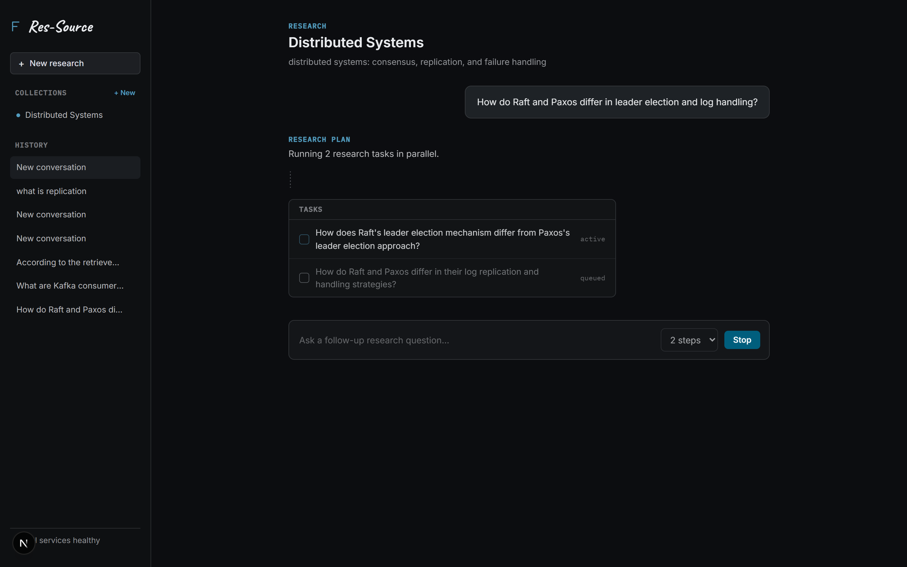

# Res-Source

**A research assistant that answers only from a corpus you build — and tells you when it can't.**

It takes a question, plans it into independent research tasks, runs them in
parallel, checks whether the retrieved evidence can actually support an answer,
then either writes one with citations resolved back to real passages, or
abstains and says what's missing.

Built on **LangGraph** and **LangChain**, served by **FastAPI**, with a
**Next.js** front end that streams the workflow as it happens.



---

## Contents

- [Why not just RAG](#why-not-just-rag)
- [How it works](#how-it-works)
- [See it work](#see-it-work)
- [Quickstart](#quickstart)
- [Using it](#using-it)
- [Configuration](#configuration)
- [Testing](#testing)
- [Project layout](#project-layout)
- [Notes and limits](#notes-and-limits)

---

## Why not just RAG

A plain `retrieve → stuff → answer` chain has no opinion about whether it
*should* answer. Five things here change that:

| | What it does | Why it matters |
|---|---|---|
| **Triage** | Classifies the question before searching | Small talk and under-specified questions never reach the vector store |
| **Parallel planning** | Splits a question into independent tasks, run at once | A comparison question researches both sides simultaneously, not in sequence |
| **Query expansion** | Each task becomes several differently-worded searches | Finds documents whose vocabulary doesn't match the user's |
| **Evidence gate** | A branch decides whether to answer at all | Abstention is a decision the graph makes, not a behaviour the prompt begs for |
| **Resolved citations** | Every `[n]` mapped back to the passage it came from | A citation pointing at nothing is caught and shown, not silently trusted |

---

## How it works

### The system



Postgres is the authority on what exists; Elasticsearch only holds vectors.
Ingestion never runs on the request path — adding a source returns `202` with a
job id, and the worker picks it up.

### The research graph



Every plan step is dispatched at once. Each runs the **researcher subgraph**,
which fans out again over several rewritten queries:



So a 3-step plan with 3 queries per step is **9 concurrent retrievals**, not
three rounds of three.

### Ingestion



Chunk ids hash collection + source + content, so re-ingesting a document updates
it in place. Pruning runs *after* indexing, so nothing is ever briefly absent.

### A question, end to end



Only workflow milestones are streamed — never raw model reasoning.

---

## See it work

**Sources ingest asynchronously**, reporting a real stage rather than a spinner.
A large PDF can take minutes; the UI stays honest about where it is.



**Research streams as it happens** — the plan appears, then each task ticks off
as it lands, out of order.



---

## Quickstart

**Prerequisites:** Python 3.10+, Node 20+, Docker, and a free
[Groq API key](https://console.groq.com/keys).

```bash
git clone https://github.com/Abhishek-k03/Res-Source.git
cd Res-Source

python -m venv .venv
.venv\Scripts\activate           # Windows;  source .venv/bin/activate elsewhere
pip install -e ".[dev]"

cp .env.example .env             # then add GROQ_API_KEY
docker compose up -d             # Elasticsearch, Postgres, Redis
```

Then three processes:

```bash
uvicorn api.main:app --port 8000      # API → localhost:8000/docs
python -m api.worker                  # worker
cd web && npm install && npm run dev  # UI  → localhost:3000
```

> Postgres and Redis are published on **5434** and **6380**, not their defaults,
> so they don't collide with anything already running locally.

Embeddings run **locally** via [fastembed](https://github.com/qdrant/fastembed)
(`BAAI/bge-small-en-v1.5`, ONNX, ~130 MB on first use), so ingestion is free and
offline. Groq serves the chat models only — it has no embedding endpoint.

### Try it with the sample corpus

`sample-data/distributed-systems/` holds four short documents on consensus and
replication. Create a collection, drop them in, and ask:

| Question | What it demonstrates |
|---|---|
| *Why does Raft randomise election timeouts?* | One task, one citation |
| *How do Raft and Paxos differ in leader election and the log?* | Parallel tasks, citations from both files |
| *What are Kafka's consumer group rebalancing semantics?* | **Abstains** — cites nothing, says what to add |

---

## Using it

### Web

Create a collection, add sources, ask questions. Ingestion and research progress
both stream live.

### CLI

The graphs run standalone, no API needed:

```bash
python scripts/ingest.py files --dir sample-data/distributed-systems --collection distsys
python scripts/ingest.py arxiv "raft consensus algorithm" --max 5 --collection distsys
python scripts/ingest.py urls https://arxiv.org/abs/2004.05074 --collection distsys

python scripts/ask.py "How does Raft elect a leader?" \
    --collection distsys --domain "distributed consensus"
python scripts/ask.py --chat --collection distsys
```

### API

```bash
BASE=http://localhost:8000

curl -X POST $BASE/collections -H 'Content-Type: application/json' \
  -d '{"slug":"distsys","name":"Distributed Systems","research_domain":"distributed consensus"}'

curl -X POST $BASE/collections/distsys/sources/upload -F 'file=@paper.pdf'
curl $BASE/collections/distsys/sources           # watch status reach "completed"

THREAD=$(curl -sX POST $BASE/collections/distsys/threads \
  -H 'Content-Type: application/json' -d '{}' | jq -r .id)
curl -N -X POST $BASE/threads/$THREAD/ask -H 'Content-Type: application/json' \
  -d '{"question":"How does Raft elect a leader?"}'
```

The last call streams server-sent events. Each answer is persisted with its
plan, resolved citations and evidence verdict, so `GET /threads/{id}/messages`
replays a conversation exactly as it streamed.

### In LangGraph Studio

```bash
pip install "langgraph-cli[inmem]" && langgraph dev
```

Both graphs are registered in `langgraph.json`, so you can step through nodes
and edit prompts live.

---

## Configuration

Everything tunable lives in dataclasses, settable per run through
`config["configurable"]` (or LangGraph 1.0 `context` — both are read).

| Field | Default | Notes |
| --- | --- | --- |
| `query_model` | `groq/openai/gpt-oss-20b` | Routing, planning, query generation, evidence gate |
| `response_model` | `groq/openai/gpt-oss-120b` | Writes the final cited answer |
| `research_domain` | `the indexed research corpus` | What the corpus is about; decides what counts as on-topic |
| `max_research_steps` | `3` | Tasks per plan. All run in parallel |
| `queries_per_step` | `3` | Parallel searches per task |
| `embedding_model` | `fastembed/BAAI/bge-small-en-v1.5` | Also `openai/…`, `cohere/…`, `google/…` |
| `retriever_provider` | `elastic-local` | Also `elastic` (Cloud), `pinecone`, `mongodb` |
| `index_name` | `research_agent` | One index per embedding model |
| `collection_id` | `None` | Scopes indexing and retrieval to one corpus |
| `search_kwargs` | `{"k": 5}` | Documents per query |
| `chunk_size` / `chunk_overlap` | `1000` / `200` | Ingest only |

Prompts are configuration too — override `router_system_prompt`,
`evidence_assessment_system_prompt`, `response_system_prompt` and the rest
without touching `prompts.py`.

Environment knobs: `WORKER_CONCURRENCY` (default 3), `LLM_TIMEOUT_SECONDS`,
`LLM_MAX_RETRIES`, `LLM_STRUCTURED_ATTEMPTS`.

**Vector dimensions are fixed per index.** Changing `embedding_model` means
re-indexing into a fresh `index_name`.

---

## Testing

```bash
python -m pytest tests/unit_tests         # 130 tests, offline, no API key needed
python -m pytest tests/integration_tests  # needs docker compose up -d
cd web && node e2e.mjs                    # 28 checks in a real browser
```

The unit suite stubs the model and retriever, so it exercises the real graphs
without network access. Several tests are deliberately adversarial:

- the parallel-research test **deadlocks rather than passes** if steps ever go
  back to running one at a time
- the worker-concurrency test does the same for ingestion jobs
- the durability tests strip the teardown commit, so a handler that forgets to
  commit its own mutation fails

`e2e.mjs` drives the whole product in a browser: create a collection, upload a
document, wait for the worker, ask a question, check the citation resolves, ask
a follow-up, reload, confirm an out-of-corpus question is refused, then delete.

---

## Project layout

```
src/
  shared/            configuration, retriever + embedding factories, citations
  ingest_graph/      loaders, chunking, indexing, pruning
  retrieval_graph/   router, planner, evidence gate, responder, prompts
    researcher_graph/  query expansion + parallel retrieval subgraph
  api/               FastAPI app, SQLAlchemy models, queue, worker
    routers/           collections, sources, threads
web/                 Next.js frontend + e2e.mjs browser test
scripts/             ingest.py, ask.py — CLI entrypoints
sample-data/         a small corpus to try it with
docs/                screenshots used by this README
tests/               unit (offline) and integration (live infra)
```

---

## Notes and limits

- `docker-compose.yml` is a dev fixture: security is disabled and it binds to
  `127.0.0.1`. Not a deployment.
- **No authentication.** Every collection is visible to every caller.
- The schema is created with `create_all` on startup rather than migrations, so
  a schema change needs a fresh database.
- Retrieval is dense-only — no re-ranking, and no relevance grading before
  passages reach the answer prompt.
- Citation *numbers* are verified against the retrieved set; nothing verifies
  that a correctly-resolved citation actually **supports** the sentence it sits on.
- Collections share an index, and vector dimensions are fixed per index, so all
  collections in one index share an embedding model.
- Ingestion jobs run concurrently, but each job is internally sequential: an
  arXiv query downloads its PDFs one after another, deliberately, to stay polite
  to arXiv.
- Each question starts from a clean evidence set. Follow-ups keep the
  conversation but re-retrieve rather than building on the previous turn.

---

Structure adapted from LangChain's
[rag-research-agent-template](https://github.com/langchain-ai/rag-research-agent-template).
